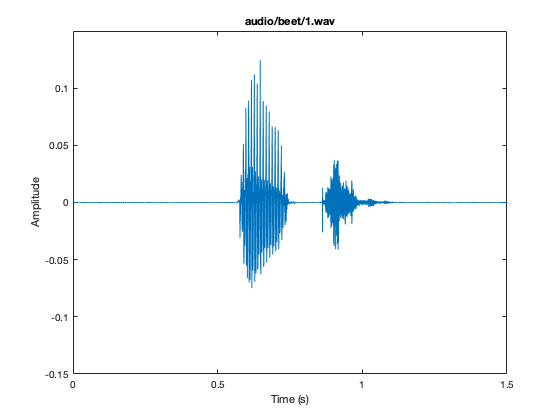
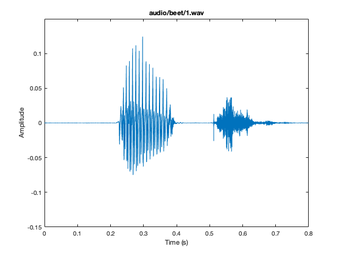
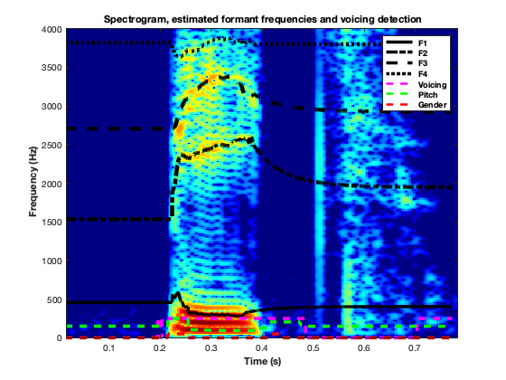
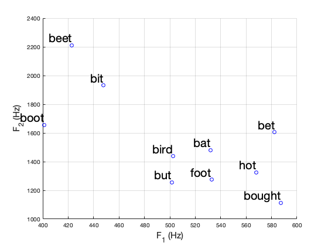
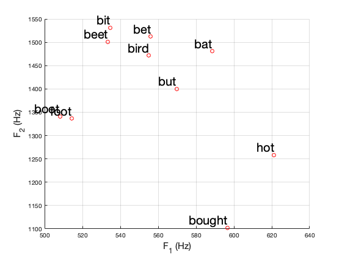
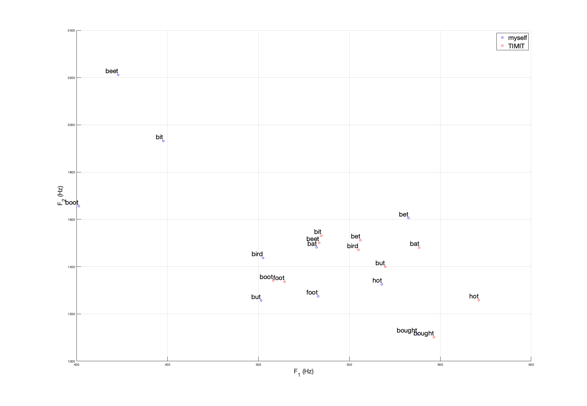
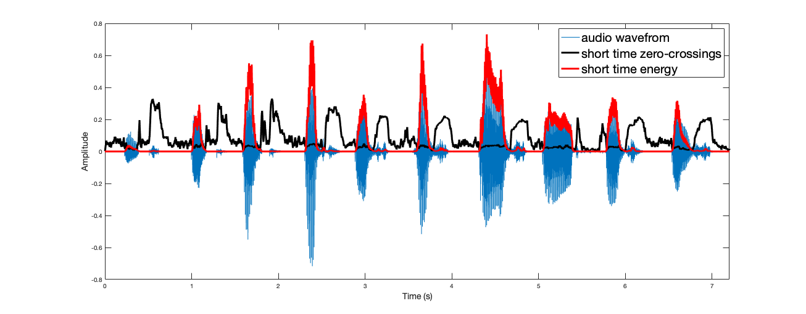
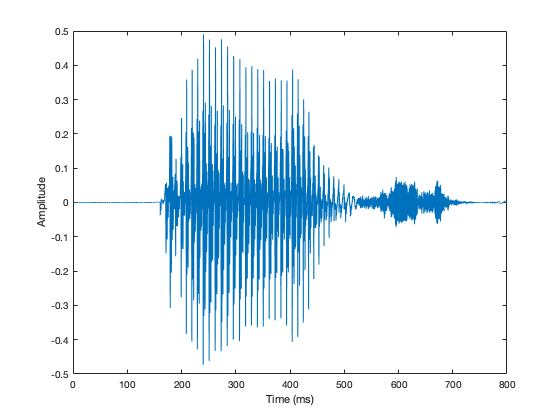
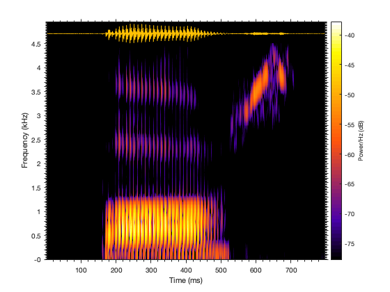
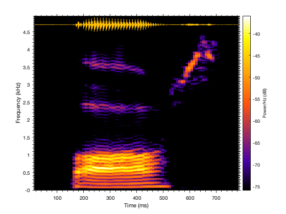

# 5C4 Speech & Audio Engineering Assingment

In this assingment I analyse my vowel space by looking at my formant frequencies and compare it with that of a speaker from the TIMIT database.

I analyse voiced vs unvoiced sppech through examining time-domain features suchs as short-time energy and short-time zero crossings.

Finally, I look at wideband vs narrowband spectograms and identify the tradeoffs associated with each.

## Requirements
- MatLab 2020b
- TIMIT speech corpus.
- The following MatLab files are needed and should be added to your MatLab PATH.
    - Mustafa and Bruce (IEEE Trans. Speech Audio Processing 2006) Formant Tracker. Available  [here](https://www.ece.mcmaster.ca/~ibruce/mb_ftracker/mb_ftracker.htm).
    - Theodoros Giannakopoulos (2021). Silence removal in speech signals. Available [here](https://www.mathworks.com/matlabcentral/fileexchange/28826-silence-removal-in-speech-signals).
    - Nabin S Sharma (2021). Short-time Energy and Zero Crossing Rate. Available [here](https://www.mathworks.com/matlabcentral/fileexchange/23571-short-time-energy-and-zero-crossing-rate)

## Vowel space analysis

1. `record_vowels.m` is used to record samples of each vowel.
2. `vowel_space.m` perfroms formant analysis on the recordings and saves the resulting F1 and F2 values to a `.mat` file.
3. `vowel_space_timit.m` perfroms formant analysis on the specified TIMIT dialect speaker and saves the resulting F1 and F2 values to a `.mat` file.
4. `plot_vowel_space.m` plots the individuals vowel space and the TIMIT speaker's vowel space together.

Recording of "beet" in time domain

Recording of "beet" after silenve removal

Output of Formant analysis. 

My vowel space

TIMIT speaker vowel space

My vowel space vs TIMIT speakers

## Voiced/Unvoiced speech

`zc_and_energy.m`

Time domain speech with short time energy and short time zero crossing rate shown.

## Spectograms

`spectogram.m`

Time domain signal

Narrowband spectogram

Wideband spectogram

